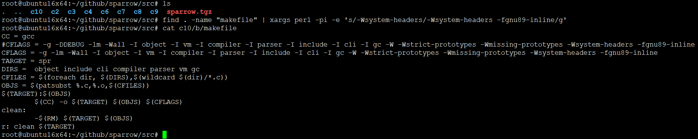

# 《自制编程语言》学习笔记

## 本仓库内容

* 《自制编程语言》源码 ```src/sparrow.tgz```
* 《自制编程语言》读书笔记 ```docs/*```
* 《自制编程语言》样章阅读 ```reference/自制编程语言-样章.pdf等```

## 相关站点

* GitBook访问地址:<https://yifengyou.gitbooks.io/sparrow/content/>
* GitHub访问地址:<https://github.com/yifengyou/sparrow/>

```
Something I hope you know before go into the coding~
First, please watch or star this repo, I'll be more happy if you follow me.
Bug report, questions and discussion are welcome, you can post an issue or pull a request.
```

## 参考书目


## 内容简介

该书全面从脚本语言和虚拟机介绍开始，讲解了词法分析的实现、一些底层数据结构的实现、符号表及类的结构符号表，常量存储，局部变量，模块变量，方法存储、虚拟机原理、运行时栈实现、编译的实现、语法分析和语法制导自顶向下算符优先构造规则、调试、查看指令流、查看运行时栈、给类添加更多的方法、垃圾回收实现、添加命令行支持命令行接口。

该书旨在用C语言完成一个简单的脚本语言(A object-oriented script language)。

编程语言用C，编译环境x86

基础开发环境

1. 宿主操作系统采用CentOS 6.8
2. 编译器Gcc版本 gcc version 4.4.7 20120313（高版本可能需要解决编译问题，看下面常见问题解决）


## 《自制编程语言》目录

* [第0章-一些可能令人迷惑的问题](docs/第0章-一些可能令人迷惑的问题/第0章-一些可能令人迷惑的问题.md)
* [第1章-设计一种面向对象脚本语言](docs/第1章-设计一种面向对象脚本语言/第1章-设计一种面向对象脚本语言.md)
* [第2章-实现词法分析器](docs/第2章-实现词法分析器/第2章-实现词法分析器.md)
* [第3章-类与对象](docs/第3章-类与对象/第3章-类与对象.md)
* [第4章-原生方法及基础实现](docs/第4章-原生方法及基础实现/第4章-原生方法及基础实现.md)
* [第5章-自上而下算符优先—TDOP](docs/第5章-自上而下算符优先—TDOP/第5章-自上而下算符优先—TDOP.md)
* [第6章-实现语法分析与语义分析](docs/第6章-实现语法分析与语义分析/第6章-实现语法分析与语义分析.md)
* [第7章-虚拟机](docs/第7章-虚拟机/第7章-虚拟机.md)
* [第8章-内建类及其方法](docs/第8章-内建类及其方法/第8章-内建类及其方法.md)
* [第9章-垃圾回收](docs/第9章-垃圾回收/第9章-垃圾回收.md)
* [第10章-命令行及调试](docs/第10章-命令行及调试/第10章-命令行及调试.md)
* [勘误](docs/勘误/勘误.md)

## 常见问题

1. 编译报错

```
vm/core.o：在函数‘primObjectIs’中：
/root/github/sparrow/src/c4/b/vm/core.c:103：对‘getClassOfObj’未定义的引用
vm/core.o：在函数‘primObjectType’中：
/root/github/sparrow/src/c4/b/vm/core.c:129：对‘getClassOfObj’未定义的引用
collect2: error: ld returned 1 exit status
makefile:9: recipe for target 'spr' failed
make: *** [spr] Error 1
```

解决方法：

修改makefile文件,在CFLAGS中添加```-fgnu89-inline```

```
CC = gcc
#CFLAGS = -g -DDEBUG -lm -Wall -I object -I vm -I compiler -I parser -I include -I cli -I gc -W -Wstrict-prototypes -Wmissing-prototypes -Wsystem-headers
CFLAGS = -g -lm -Wall -I object -I vm -I compiler -I parser -I include -I cli -I gc -W -Wstrict-prototypes -Wmissing-prototypes -Wsystem-headers -fgnu89-inline
TARGET = spr
DIRS =  object include cli compiler parser vm gc  
CFILES = $(foreach dir, $(DIRS),$(wildcard $(dir)/*.c))
OBJS = $(patsubst %.c,%.o,$(CFILES))
$(TARGET):$(OBJS)
	$(CC) -o $(TARGET) $(OBJS) $(CFLAGS)
clean:
	-$(RM) $(TARGET) $(OBJS)
r: clean $(TARGET)
```

修改过后必须先```make clean```一下,你应该知晓makefile是根据时间撮判断，那么先前编译通过的，但是并没有报错不会再次编译，毕竟你也没有改过源码文件，时间撮也没有变。

那么如何批量替换呢？？考验shell脚本编程功底，一句话搞定式
```
find . -name "makefile" | xargs perl -pi -e 's/-Wsystem-headers/-Wsystem-headers -fgnu89-inline/g'
```



之后便可在高版本gcc中编译，本人使用的版本是gcc version 7.3.0 (Ubuntu 7.3.0-16ubuntu3) 运行在Ubuntu 18.04.1 LTS x64

## 总结

```
  1.基础永远值得花费90%的精力去学习加强。厚积而薄发~
```


