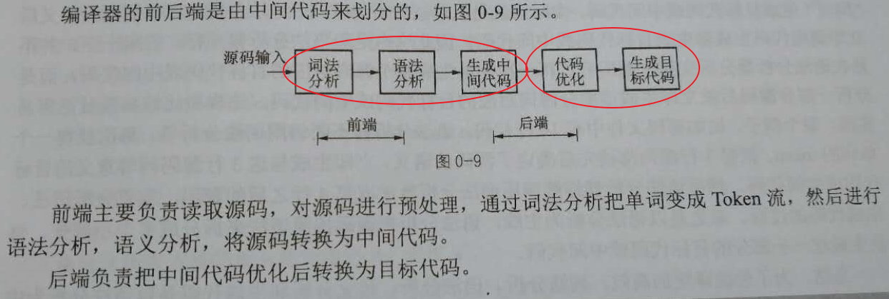
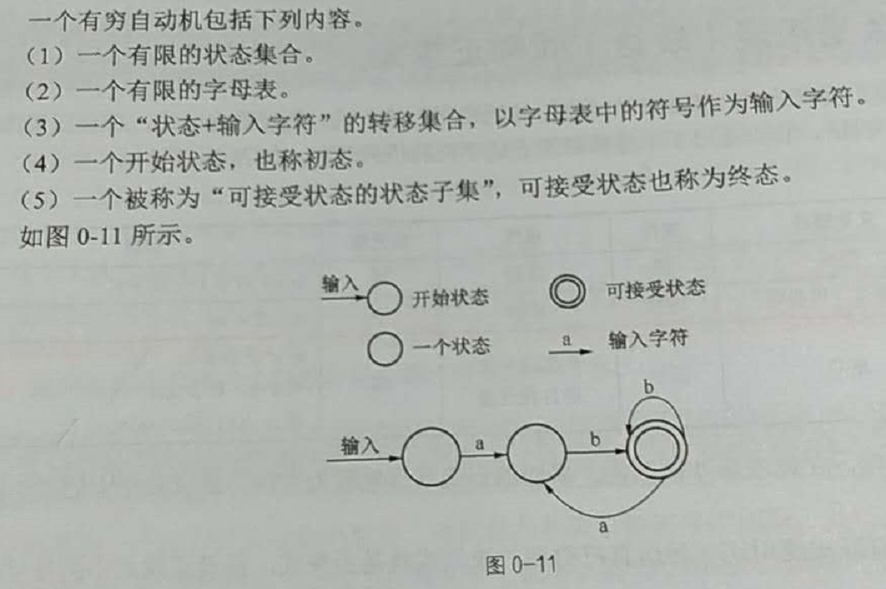
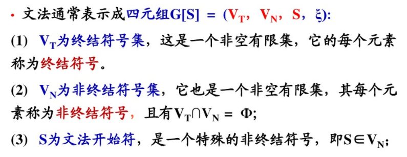
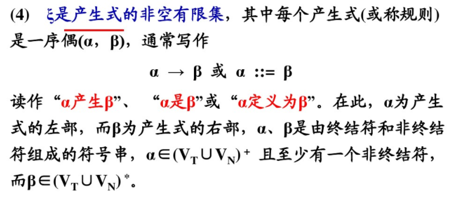
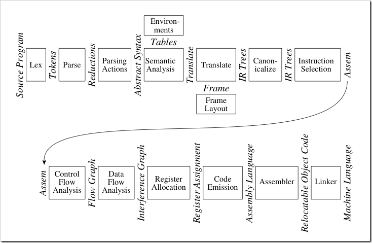

<!-- TOC depthFrom:1 depthTo:6 withLinks:1 updateOnSave:1 orderedList:0 -->

- [第0章-一些可能令人迷惑的问题](#第0章-一些可能令人迷惑的问题)
	- [成功的基石不是坚持，而是“不放弃”](#成功的基石不是坚持而是不放弃)
	- [你懂编程语言的“心”吗？](#你懂编程语言的心吗)
	- [编程语言的来历](#编程语言的来历)
	- [语言一定要更底层的语言来编写吗？](#语言一定要更底层的语言来编写吗)
	- [脚本语言的分类](#脚本语言的分类)
	- [为什么CPU要用数字而不是字符串作为指令](#为什么cpu要用数字而不是字符串作为指令)
	- [为什么脚本语言比编译型语言慢](#为什么脚本语言比编译型语言慢)
	- [既然脚本语言比较慢，为什么大家还要用](#既然脚本语言比较慢为什么大家还要用)
	- [什么是中间代码？](#什么是中间代码)
	- [什么是编译器的前端、后端](#什么是编译器的前端后端)
	- [词法分析、语法分析、语义分析和生成代码并不是串行执行](#词法分析语法分析语义分析和生成代码并不是串行执行)
	- [什么是符号表](#什么是符号表)
	- [什么是关系中的闭包](#什么是关系中的闭包)
	- [什么是程序中的闭包](#什么是程序中的闭包)
	- [什么是字母表](#什么是字母表)
	- [什么是语言](#什么是语言)
	- [正规式就是正则表达式](#正规式就是正则表达式)
	- [什么是正规（表达）式和正规集](#什么是正规表达式和正规集)
	- [什么是有穷自动机](#什么是有穷自动机)
	- [有穷自动机和词法分析的关系](#有穷自动机和词法分析的关系)
	- [词法分析用有穷自动机(有穷状态自动机)的弊端](#词法分析用有穷自动机有穷状态自动机的弊端)
	- [什么是文法](#什么是文法)
	- [END](#end)

<!-- /TOC -->
# 第0章-一些可能令人迷惑的问题

## 成功的基石不是坚持，而是“不放弃”

* 编译原理还是很难滴，说不难是对大家上进心的不尊重
* 选择技术的原因只是我没有辣么讨厌它，它是我从众多讨厌的事物中选择的最不讨厌的东西。这个思维很有趣
* 凡事靠坚持来做的事情必然建立在痛苦之上，痛苦使人产生放弃念头
* 不要给自己“可以放弃”的念头，不要让“可以放弃”成为一种选项，把选项去掉，剩下成功只是时间问题

## 你懂编程语言的“心”吗？

* 语言的“心”本质就是编译器，程序员多数了解如何使用编译器，如何满足编译器规则写出相应的代码。极少数了解编译器到底做了哪些工作
* 编程语言的本质就是 编译器将人类思想转换为“计算机行为”的语法规则。将高级语言转换为低级语言，将人可阅读的符号转换为机器可执行二进制序列，将需求转换为实现


## 编程语言的来历

* 世界上本没有编程语言，有的只是编译器
* 语言本身只是一系列语法规则。规则对应着行为，行为才是编程的意图
* 编译器就是规则到行为的解析。语言规则多样性，但是本质都是万变不离其宗

## 语言一定要更底层的语言来编写吗？

* 该问题等价于，编译器是否由其他编译器实现？对的可以的，但是如果追溯到一开始，C语言难道不是汇编写的么？然后再用C语言编译器造出更牛逼的C语言编译器，确实是这样的，典型的编译器新增特性就是在原来基础上增加，典型的Gcc源码编译，也是用Gcc编译新的Gcc
* **肯定是现有编程语言，然后制造配套的编译器**，编译器的制造是根据编程语言的规则来开发的，类似于按照图纸盖楼一样
* C语言有很多种编译器支持，每种编译器有不同特性，为此肯定会有兼容性问题，所以也肯定会诞生很多标准，这都是想都不用想肯定会涉及到的问题。
* **工具可以用来造工具，编译器可以用来造编译器**
* 编译器基本功能就是读写文件，读源码，写汇编，交给你汇编器搞成机器码。平常用的gcc一条龙服务你看不到中间文件的生成，但是如果编译的时候加一些选项你就看到了。
* 最初的编译器使用机器码写的，这个没意见吧？
* Python虚拟机、Java虚拟机其实就是充当CPU的作用，他们本身要做到跨平台，目的是为了让上层保持一致，虚拟机运行环境可以多样性。
* 执行PHP脚本的时候，其实就是启动一个C语言解释器来解释PHP脚本，解释器其实就是一个进程，和普通进程没啥两样。执行bash脚本的时候也是这样。脚本输入的就是符合对应解释器可执行的字符串，这些字符串懂得程序员可直接识别，不懂至少能看懂abcde，懂和不懂区别在于是否理解其中的语法规则而不在于是否知道某个字符怎么拼写，能有啥意思

```
<?php
	echo "hello php";
>
```

* php解释器分析上面文本，发现echo关键字，直接调用C语言提供的输出函数，典型printf
* 如果CPU的操作数是字符串的话，那CPU就能直接执行脚本语言喽，没毛病，但是字符串必须符合规则。所以区别脚本语言和编译型语言一大方法就是，对应“CPU”执行的是字符串还是二进制机器码。后者肯定更高效，前者更高级，所谓的高级其实就是更接近人的思维。


## 脚本语言的分类

* 基于命令的语言系统
	- 每一行的代码实际上就是命令和对应参数
	- 早期汇编语言形式，典型的批处理bat或sh
	- 解释器**逐行**分析文件，执行对应命令处理函数
* 基于规则的语言系统
	- 满足规则触发
	- 语言结构：谓词逻辑->动作(条件->动作)
	- 主要用于人工智能，典型代表Prolog。(没玩过)
* 面向过程的语言系统
	- 是```基于命令的语言系统```的升级版，可以处理一些简单的语句。有函数，有判断，有循环
	- shell脚本、perl、lua都是
* 面向对象的语言系统
	- 现代脚本基本是面向对象，典型的Python
	- **不是含有class关键字的都叫面向对象**

* 世界上第一个血统纯正的面向对象的语言是smalltalk，它在实现上一切接对象，具有完全面向对象的基因。

## 为什么CPU要用数字而不是字符串作为指令

* CPU的输入是硬编码，二进制代码
* 脚本解释器的输入是字符串，不能使硬编码


## 为什么脚本语言比编译型语言慢

* 程序执行的快慢是比较出来的
* 脚本语言执行的时候解释器也是二进制程序，二进制程序解释脚本字符串
* 编译型语言一次编译，可在兼容平台直接运行，运行的时候就是二进制，过程步骤相对少些
* 编译型程序执行时候只有一个IO，而脚本程序执行时候有两个，运行解释器，解释器加载脚本。毕竟IO很慢


## 既然脚本语言比较慢，为什么大家还要用

* 脚本相对简单，具体简单在哪里？效率高在哪里？快速开发，面向高薪开发

## 什么是中间代码？

* 很多编译器会将源文件编译为中间代码，然后再编译为目标代码
* 中间代码不是必须的，介于源程序和机器语言之间的语言
* 目标代码与体系结构高度相关
* 为嘛不直接生成目标代码？
	- 跨平台
	- 优化


## 什么是编译器的前端、后端



## 词法分析、语法分析、语义分析和生成代码并不是串行执行

* 编译阶段的几个部分
	- 词法分析 - 词法分析器
	- 语法分析 - 语法分析器
	- 语义分析 - 语义分析器
	- 生成中间代码 - 代码生成器
	- 优化中间代码
	- 生成目标代码
* 一个优秀的编译器不会串行执行这些步骤
* 编译器是以语法分析器为主线，由语法分析器穿插调用词法分析器和代码生成器
* 为了使编译更加高效，词法分析、语法分析、语义分析和生成代码是以语法分析为中心并行执行，词法分析和生成代码都是语法分析器调用的子例程
* 语法分析和语义分析并行
	- 语法分析和语义分析可以合并，分析完主谓宾定状补就可以知道语义了
* 语法分析和词法分析并行
* 语法分析和语法制导并行（分析语法过程中生成目标代码或中间代码）

## 什么是符号表

* 首先不管编程的时候输入的标识符是个什么锤子，变量、函数、字符串，都是有地址才能访问到，辣么，你怎么确定变量的地址？变量存储在哪里？
* 如果引用一个外部变量，那么你在生成目标代码的时候，还没有链接，是无法确定地址的。这时候怎么办？
* 符号表的作用就是将人类可识别的字符串转换成机器可识别的地址，酱紫就可以引用访问
* 编译器会把符号表的索引作为指令的操作数
* 符号表可以用链表，散列表，数组实现

## 什么是关系中的闭包

* 什么锤子闭包？某集合中的元素的运算结果还在该集合中，这种特征的**运算**是闭包的，简称**闭包运算**
* 闭包(closure)，是指函数变量可以保存在函数作用域内，因此看起来是函数将变量“包裹”了起来

那这样说来，包含变量的函数就是闭包

```
//按照古老定义，包含变量n的函数foo就是闭包
function foo() {
    var n = 0;
}
console.log(n)//Uncaught ReferenceError: n is not defined
```

* 闭包是指可以访问其所在作用域的函数
* 闭包是指有权访问另一个函数作用域中的变量的函数


这，我也很懵逼，后头来补补


## 什么是程序中的闭包

* 程序中的闭包就是在函数中定义的函数，内部函数引用了外层函数中的局部变量
* 这里书上解释了一大堆，就是要让你明白，函数内部的内部的内部的变量作为函数返回值，为嘛还特么的能作为右值？
	- 函数内部可以再定义函数
	- 内部的内部可以调用它外层的变量 = 好吧四合院里面的小院可以看到大院，俄罗斯娃娃最里层
	- 函数返回的时候堆栈回收了，为嘛返回值还能传出来？编译器拷贝了返回值的缘故

```
int add(int a,int b)
{
	return a+b;
}
int main()
{
	int result = add(1,2);
}
```


## 什么是字母表

* 字母表必须是有穷符号表，符号表必须是有限集合
* 任何表达式都是由符号组成，符号肯定属于某个集合，表达式也应该是在该集合上有效，字母表就是符号表

## 什么是语言

* 语言是由字母表、文法和语义组成

## 正规式就是正则表达式

* 正规式就是正则表达式，没啥区别，都是模式匹配
* 正规式就是最原始的正则表达式

## 什么是正规（表达）式和正规集

* 正规集就是正规式所能表示的所有表达式的集合

## 什么是有穷自动机

* 有穷自动机(Finate Automata),也叫有穷状态自动机，是一种数学模型，也叫有限状态自动机。


* 模型对应于系统中有限个数的系统状态，系统只需要根据当前所处的状态和面临的输入就能够决定系统的后继行为，当系统处理了输入后，系统的状态也随之改变
* 有穷状态自动机居然是两位神经物理学家提出的概念模型。人脑也是有穷状态自动机，虽然数量庞大，但是依然是有穷的




## 有穷自动机和词法分析的关系

* 有穷自动机和词法分析的关系没有本质关系
* 有穷状态自动机可以用来作为词法分析的工具，但也可以不用
* 有穷状态自动机是词法分析的一种实现，但不是必须
* 词法分析是按照文法的规则来识别单词，文法是人设计的，同样，人在设计词法分析的工具时要按照人制定的文法规则来跑

## 词法分析用有穷自动机(有穷状态自动机)的弊端

* 有穷自动机是词法分析实现的一个经典方案，但不是最好的
* 效率低-需要重复进入状态分支
* 需要设置太多状态，编码麻烦


## 什么是文法

* 很好的例子，如果一首曲子你无法哼唱给别人听，那咋办，靠乐谱。如果你设计一门语言，如何向别人表述用法？靠文法
* 文法就是描述语言语法规则的方法









## END
